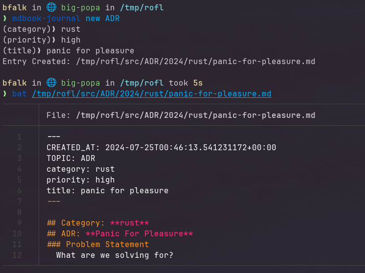

<!-- markdownlint-disable MD041 -->
<!-- markdownlint-disable MD013 -->

<!-- markdownlint-disable MD033 -->

<!-- markdownlint-enable MD033 -->

---

# 🗒️ mdBook Journal _(beta)_

Workflow tool that allows you to generate templated documentation,
notes, measurements... or really anything. At it's core is the concept
of a journal "topic". You specify what core data is tracked for
each topic and then get to work!

**NOTE:** Plugin project for the [`mdBook`] documentation system. It's
not very complex; however, you will need to understand how it works in
order to take advantage of some of the functionality of this tool.

[`mdBook`]: https://rust-lang.github.io/mdBook/

## 🔩 Demo Example

Let's say that you want to document every major [`architectural decision`]
your team makes.

From your `book.toml` you can define such a topic:

```toml
{{#include .example.book.toml}}
```

In this example the topic name is `ADR` and has three
defined data points of `title`, `category`, and `priority`.
This ensures that each record created will collect
those three following data points.

Once a topic is setup an "entry" can be created for
it. Here is an example command to create a decision
record:



```bash
markdown-journal new ADR
```

This will produce a prompt that collects these
data points:

```bash
(category)❯ rust
(priority)❯ high
(title)❯ panic for pleasure
```

Assuming the above was entered it will produce the
following file in your project:

`src/ADR/2024/rust/panic-for-pleasure.md`

```markdown
---
CREATED_AT: 2024-07-25T00:46:13.541231172+00:00
TOPIC: ADR
category: rust
priority: high
title: panic for pleasure
---

## Category: **rust**

## ADR: **Panic For Pleasure**

### Problem Statement

What are we solving for?
```

This top part of a markdown spec called `front matter`. It
allows for assigning specific data and is at the forefront
of how the journal operates. All entries added this way
are automatically included in the generated HTML documents
without needing to include them in the `SUMMARY.md` file.

[`architectural decision`]: https://adr.github.io/

## ⚙️ Install Locally

Currently to install you'll need to clone this repo and
install with cargo:

```bash
git clone https://github.com/benfalk/mdbook-journal.git
cargo install --path mdbook-journal
```

Verify that it's installed correctly:

```bash
mdbook-journal -V
```

`mdbook-journal 0.1.5-alpha`
